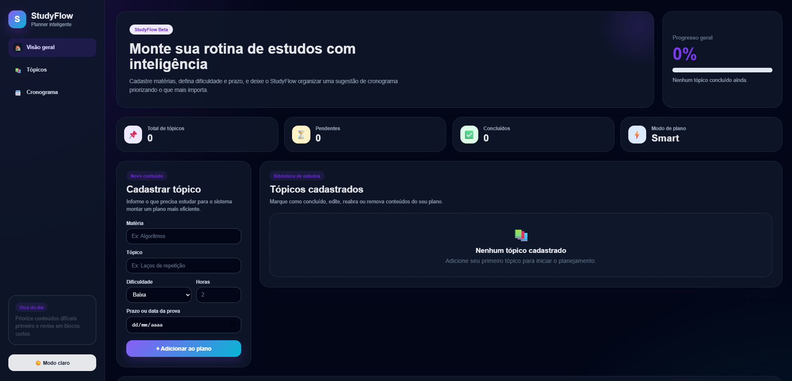
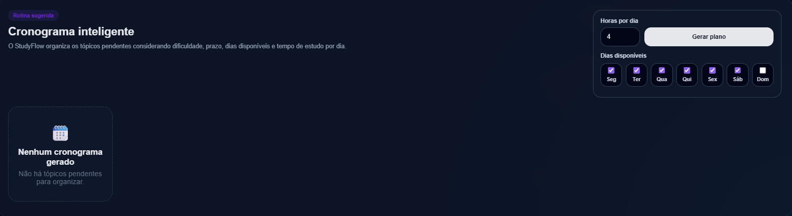
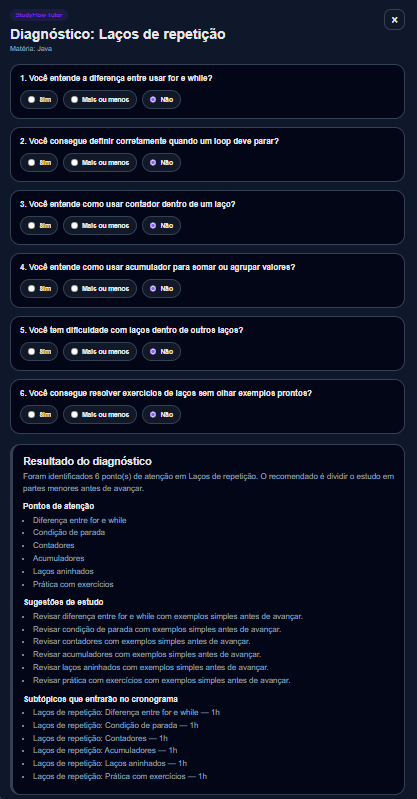

# StudyFlow - Planejador Inteligente de Estudos

O **StudyFlow** é um sistema web para organização de estudos, desenvolvido para ajudar estudantes a planejarem sua rotina de forma mais clara, personalizada e inteligente.

O sistema permite cadastrar tópicos de estudo, definir prazos, configurar dias disponíveis, gerar um cronograma semanal e usar um Tutor Inteligente baseado em regras para diagnosticar dificuldades e aplicar subtópicos diretamente no cronograma.

---

## Visão geral

O objetivo do StudyFlow é facilitar a criação de uma rotina de estudos personalizada.

Com o sistema, o usuário pode:

- cadastrar tópicos de estudo;
- informar matéria, dificuldade, tempo estimado e prazo;
- escolher quais dias da semana deseja estudar;
- definir quantas horas tem disponíveis por dia;
- gerar um cronograma semanal;
- editar, concluir, reabrir e excluir tópicos;
- usar um Tutor Inteligente para diagnosticar dificuldades;
- aplicar subtópicos gerados pelo Tutor apenas no cronograma;
- remover o Tutor e voltar a usar o tópico original no cronograma.

---

## Funcionalidades

### Gerenciamento de tópicos

O StudyFlow permite que o usuário gerencie seus conteúdos de estudo por meio de operações básicas de cadastro e controle.

Funcionalidades disponíveis:

- cadastro de tópicos;
- listagem de tópicos cadastrados;
- edição de tópicos;
- exclusão de tópicos;
- marcação de tópico como concluído;
- reabertura de tópico concluído;
- exibição de status;
- exibição da dificuldade;
- exibição do prazo;
- exibição do tempo estimado.

---

## Tecnologias utilizadas

### Front-end

- **HTML5**  
  Utilizado para estruturar a interface da aplicação, incluindo os formulários, cards de tópicos, painel do cronograma e modal do Tutor.

- **CSS3**  
  Utilizado para estilização visual do sistema, responsividade, modo escuro, layout em cards, botões, painel lateral, cronograma semanal e modal de diagnóstico.

- **JavaScript**  
  Utilizado para manipulação do DOM, controle dos eventos da interface, integração com a API Flask, renderização dinâmica dos tópicos, cronograma semanal e funcionamento do Tutor.

- **LocalStorage**  
  Utilizado para salvar informações locais no navegador, como:
  - preferência de tema claro/escuro;
  - subtópicos aplicados ao cronograma;
  - tópicos ignorados no cronograma quando o Tutor está aplicado.

---

### Back-end

- **Python**  
  Linguagem utilizada para desenvolver a API do sistema e implementar as regras de negócio.

- **Flask**  
  Framework utilizado para criação da API REST, rotas de tópicos, cronograma e diagnóstico do Tutor.

- **Flask-CORS**  
  Utilizado para permitir a comunicação entre o front-end e o back-end durante a execução local.

- **JSON**  
  Utilizado como forma simples de persistência dos dados, armazenando os tópicos cadastrados no arquivo `dados.json`.

---

### Ferramentas de desenvolvimento

- **Visual Studio Code**  
  Utilizado como editor de código durante o desenvolvimento.

- **Git**  
  Utilizado para versionamento do projeto.

- **GitHub**  
  Utilizado para hospedagem do repositório e apresentação do projeto no portfólio.

### Cronograma semanal inteligente

O sistema gera um cronograma semanal com base nos tópicos pendentes e nas preferências informadas pelo usuário.

O cronograma considera:

- tópicos pendentes;
- dificuldade;
- prazo;
- tempo estimado;
- dias disponíveis para estudo;
- quantidade de horas disponíveis por dia;
- subtópicos gerados pelo Tutor, quando aplicados.

O cronograma respeita a carga horária configurada pelo usuário.

Exemplo:

```text
Horas por dia: 4
Dias disponíveis: Segunda, Terça, Quarta, Quinta e Sexta

## Screenshots

### Tela principal



### Cronograma semanal



### StudyFlow Tutor


